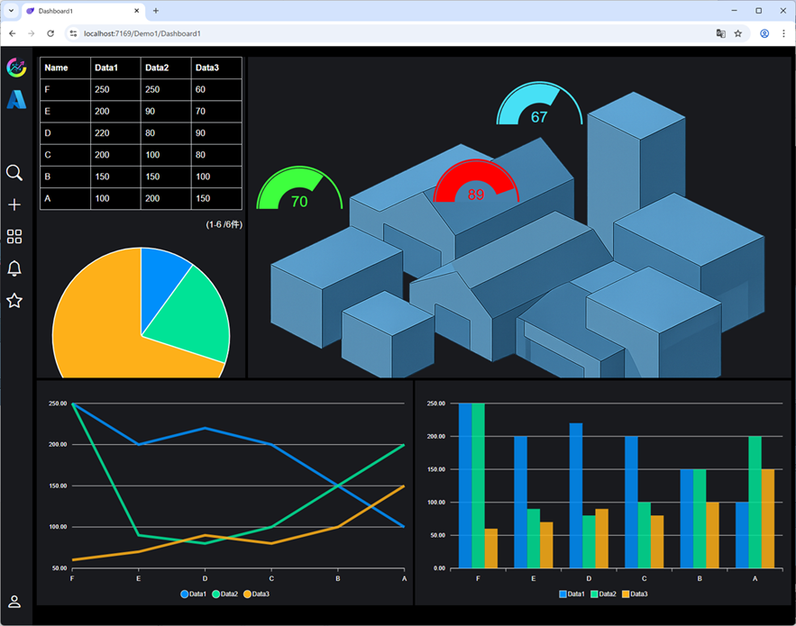

# Codeer.LowCode.Bindings.ORiN3

## Overview
**Codeer.LowCode.Bindings.ORiN3** is a .NET library designed for the **Codeer.LowCode.Blazor** low-code development platform. It enables real-time communication with industrial equipment such as PLCs via the **ORiN3** module, allowing you to build responsive dashboards using low-code techniques. Ideal for use cases such as factory monitoring systems and IoT dashboards where live equipment data needs to be visualized and acted upon.

## What is ORiN3?
**ORiN3** (Open Robot/Resource interface for the Network, version 3) is the third generation of the ORiN standard, originally proposed by the Japan Robot Association (JARA). It provides a **unified API interface** to control and monitor various industrial devices such as robots, PLCs, and sensors, regardless of manufacturer. ORiN3 adopts a **gRPC-based Remote Engine** architecture, where device-specific "providers" (drivers) can be dynamically loaded and accessed remotely.

With this library, you can access any device that has an ORiN3 provider, send and receive data, and control devices from a Blazor frontend—all with minimal code.

## Features
- **Real-time communication**: Send and receive data through ORiN3 providers quickly and reliably. Visualize sensor readings or device states in real time. Device control is also supported.
- **Low-code integration**: Designed for the Codeer.LowCode.Blazor platform, this library allows you to bind ORiN3 data sources and UI components using drag-and-drop and simple scripts.
- **Blazor-native**: Seamless integration with Blazor allows you to build frontend and backend logic in C#. No need for additional JavaScript or separate REST APIs. Combine with other Blazor components like charts or data grids.
- **Scalable and extensible**: Leverage a wide range of ORiN3 providers for major industrial devices. Easily add new providers or customize communication as needed.

## Installation
TODO

## Getting Started Example
TODO

In actual use, you'll typically bind ORiN3 data sources to visual components in the Codeer.LowCode UI without writing code, such as linking sensor values to gauge or chart components.

## Screenshot
  
*A sample dashboard built with Codeer.LowCode and ORiN3 showing gauges, 3D diagrams, tables, and charts with live device data.*

## License
This library is distributed under the **MIT License**. You are free to use, modify, and distribute it for commercial and non-commercial purposes.
